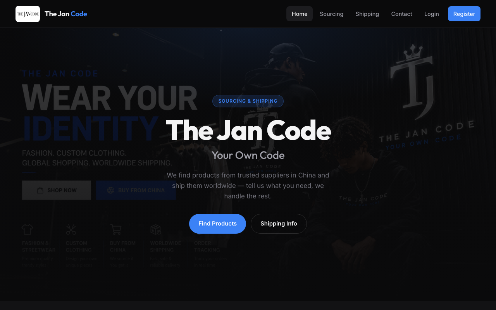
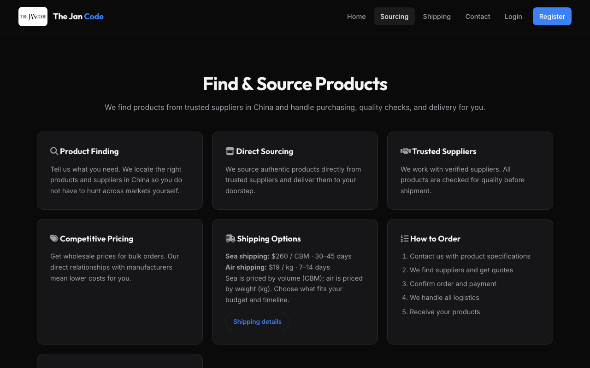
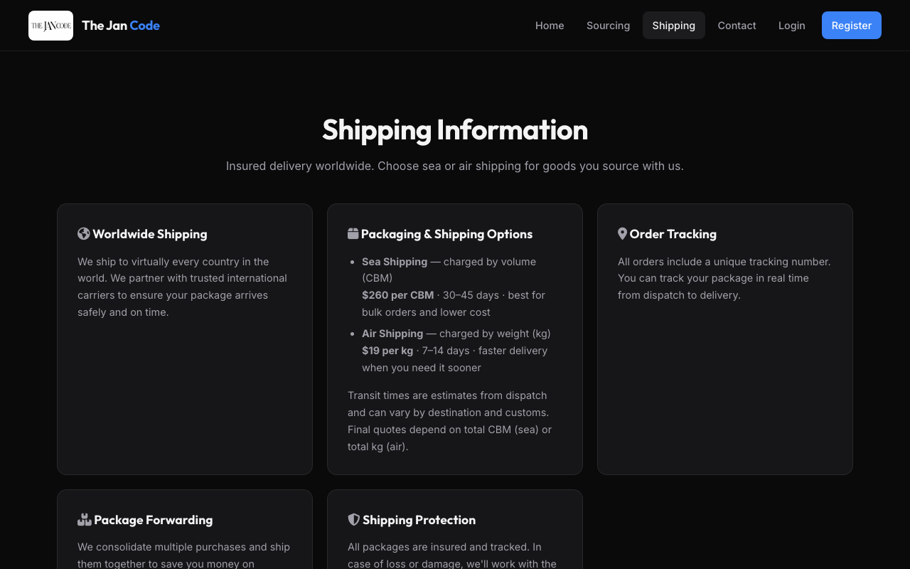

# The Jan Code (Clothing & Shipping)

Flask web app for **The Jan Code** — product sourcing from China, clothing & goods, and worldwide shipping.

> **Your Own Code.** We find products from trusted suppliers in China and ship them worldwide.

## Live preview (screenshots)

### Home


### Sourcing / Buy from China


### Shipping


## Features

- Product sourcing (“Buy from China”) service pages  
- Shipping info (sea & air options)  
- User registration & login  
- Cart, checkout, and order history  
- Contact page  
- Admin access for store management  

## Tech stack

- **Python** + **Flask**
- **SQLite** database
- HTML templates (Jinja2)
- CSS / JavaScript frontend

## Run locally

```bash
# 1. Create a virtual environment (optional but recommended)
python3 -m venv .venv
source .venv/bin/activate   # Windows: .venv\Scripts\activate

# 2. Install dependencies
pip install -r requirements.txt

# 3. Start the server
python server.py
```

Then open: **http://127.0.0.1:5000**

### Main pages

| Page | URL |
|------|-----|
| Home | http://127.0.0.1:5000/ |
| Sourcing | http://127.0.0.1:5000/buy-from-china |
| Shipping | http://127.0.0.1:5000/shipping |
| Contact | http://127.0.0.1:5000/contact |
| Login | http://127.0.0.1:5000/login |
| Register | http://127.0.0.1:5000/register |

## Project structure

```text
.
├── server.py           # Flask app & routes
├── requirements.txt
├── templates/          # HTML pages
├── static/             # CSS, JS, images
├── docs/screenshots/   # UI previews for this README
└── store.db            # Local SQLite DB (created at runtime, not in git)
```

## Environment

Optional secret key (recommended for anything beyond local demo):

```bash
export SECRET_KEY="your-secure-random-string"
python server.py
```

## Author

**Jonathan-Anyame** — [GitHub](https://github.com/Jonathan-Anyame)
